<!-- ========================== DYNAMIC HEADER WITH GRADIENT ========================== -->
<div align="center">


<!-- ========================== ENHANCED TYPING ANIMATION ========================== -->
<p align="center">
  
</p>

<!-- ========================== PREMIUM CONTACT SECTION ========================== -->
<div style="margin: 30px 0;">

[](mailto:elvisboateng557@gmail.com)
[](https://www.linkedin.com/in/elvis-boateng-boampong-3b6264341/)
[](https://www.leetcode.com/el-wise557)
[](http://www.youtube.com/@ElvisBoateng-q1u)

</div>

<!-- ========================== ENHANCED METRICS ========================== -->


</div>

---

<!-- ========================== ENHANCED ABOUT SECTION ========================== -->
## 🌟 **DIGITAL INNOVATOR & PROBLEM SOLVER**

<div align="center">

```typescript
interface Developer {
  name: "Boateng Elvis";
  title: "Software Engineer" | "Innovator" | "Lifelong Learner";
  mission: "Empowering people through technology";
  expertise: string[];
  values: string[];
  currentFocus: string[];
}

const elvis: Developer = {
  location: "Ghana 🇬🇭",
  passion: "Crafting elegant, impactful, and scalable solutions",
  mindset: "Problem solver, innovator, and lifelong learner",
  expertise: ["Full-Stack Development", "AI/ML", "Mobile Development", "System Architecture"],
  values: ["Quality over quantity", "Empathy-driven design", "Relentless learning"],
  currentFocus: ["Building amazing things 🚀", "Transforming ideas into reality ✨"]
};
```

</div>

I'm **Boateng Elvis**, a passionate **Software Engineer** who thrives on crafting **elegant, impactful, and scalable solutions**. Beyond just writing code, I see myself as a **problem solver, innovator, and lifelong learner**.

🚀 **Mission:** *Empowering people through technology*

---

<!-- ========================== CURRENT FOCUS WITH PROGRESS ========================== -->
## 🔥 **CURRENT MISSION & EXPERTISE**

<div align="center">

**🤖 Artificial Intelligence & Machine Learning** 

**📱 Mobile App Development (Flutter, React Native)** 

**🌠Full Stack Development (MERN, PHP, Laravel)** 

**🧠 Scalable Systems (C#, Java & Python)** 

</div>

---

<!-- ========================== ENHANCED CORE VALUES ========================== -->
## 💎 **CORE VALUES & PRINCIPLES**

<div align="center">

| 🎯 **Value** | 📋 **Description** | 🚀 **Impact** |
|-------------|-------------------|---------------|
| **✅ Quality over quantity** | Crafting robust, maintainable solutions | Production-ready code |
| **✅ Empathy-driven design** | User-centered development approach | Enhanced user experience |
| **✅ Relentless learning** | Continuous skill development | Cutting-edge solutions |
| **✅ Clear communication** | Transparent collaboration | Successful team projects |
| **✅ Collaboration over competition** | Knowledge sharing mindset | Community growth |

</div>

---

<!-- ========================== PREMIUM TECH STACK ========================== -->
## 🛠️ **TECH ARSENAL & EXPERTISE**

<div align="center">

### **Frontend Mastery**


### **Backend Powerhouse**  


### **Development Tools**


### **Complete Stack Visualization**


</div>

---

<!-- ========================== FEATURED PROJECTS SHOWCASE ========================== -->
## 🚀 **FLAGSHIP PROJECTS & INNOVATIONS**

<div align="center">

<table>
<tr>
<td width="33%">

### 🌍 **A1 Opportunities Africa**
*Revolutionary Travel & Study Platform*


**🎯 Mission:** Platform for international travel, study abroad, and visa assistance

**🔥 Features:** 
- International opportunity matching
- Visa assistance workflows  
- Study abroad connections

[](https://github.com/Elvis557/A1-OPPORTUNITIES-AFRICA)

</td>
<td width="33%">

### 🛒 **ElviMart E-Commerce**  
*Modern Shopping Experience*


**🎯 Mission:** Modern e-commerce application built with React + Bootstrap

**🔥 Features:**
- Responsive design
- Shopping cart functionality
- Product management

[](https://github.com/Elvis557/ElviMart-E-commerce-Site)

</td>
<td width="33%">

### 📚 **Portfolio Website**
*Personal Brand Showcase*  


**🎯 Mission:** Personal portfolio showcasing skills & projects

**🔥 Features:**
- Project showcases
- Skills demonstration
- Professional presentation

[](https://github.com/Elvis557/PERSONAL-WEBSITE)

</td>
</tr>
</table>

</div>

---

<!-- ========================== 2025 MASTER PLAN ========================== -->
## 🎯 **2025 MASTER PLAN & MILESTONES**

```mermaid
graph LR
    A[🤖 Open Source AI] --> B[🚀 SaaS Launch]
    B --> C[📚 Content Creation] 
    C --> D[🎓 Mentorship]
    D --> E[☁️ Cloud Mastery]
    
    A1[Contribute to AI & ML projects] -.-> A
    B1[Launch own SaaS product] -.-> B
    C1[Publish 2+ technical blogs] -.-> C
    D1[Mentor junior developers] -.-> D
    E1[AWS/Azure certification] -.-> E
```

<div align="center">



### **🏆 2025 ACHIEVEMENT TARGETS**

- ✅ **Open Source Impact** → Contribute to **AI & ML projects**
- ✅ **Product Innovation** → Launch my **own SaaS product**  
- ✅ **Knowledge Sharing** → Publish at least **2 technical blogs**
- ✅ **Community Building** → **Mentor junior developers** and share knowledge
- ✅ **Technical Mastery** → Achieve **AWS/Azure cloud certification**

</div>

---

<!-- ========================== GITHUB ANALYTICS DASHBOARD ========================== -->
## 📊 **GITHUB PERFORMANCE DASHBOARD**

<div align="center">

<!-- Main Stats Row -->


<!-- Languages and Activity -->


<!-- Contribution Activity Graph -->


<!-- GitHub Trophies -->


<!-- GitHub Snake Animation -->


</div>

---

<!-- ========================== COLLABORATION HUB ========================== -->
## 🤝 **COLLABORATION OPPORTUNITIES**

<div align="center">

### **🔥 READY TO COLLABORATE ON:**

<table>
<tr>
<td width="50%">

**🔢 Data Structures & Algorithms**
- Competitive programming solutions
- Algorithm optimization projects
- LeetCode problem-solving sessions

**🧱 System Architecture & Design**  
- Scalable system designs
- Microservices architecture
- Database optimization

</td>
<td width="50%">

**💻 Web & Mobile Applications**
- Full-stack web development
- Cross-platform mobile apps
- Progressive Web Applications

**🧠 AI, ML, and GPT-powered Projects**
- Machine learning models
- AI-powered applications
- Natural language processing

</td>
</tr>
</table>

### **💬 COLLABORATION PHILOSOPHY**
> *"Great things start with a conversation — let's connect!"*

[](mailto:elvisboateng557@gmail.com)

</div>

---

<!-- ========================== DEV CULTURE ========================== -->
## 💭 **DEVELOPER CULTURE & HUMOR**

<div align="center">

### **😂 DEV WISDOM**

> *"I don't always test my code, but when I do, I do it in production."*

### **💡 DAILY INSPIRATION**


### **🎯 CODING PHILOSOPHY**
```javascript
const codingPhilosophy = {
  approach: "Clean, readable, maintainable",
  testing: "Test early, test often", 
  learning: "Every bug is a learning opportunity",
  collaboration: "Code reviews make us all better",
  innovation: "Stay curious, keep building"
};
```

</div>

---

<!-- ========================== SUPPORT SECTION ========================== -->
## ☕ **FUEL THE INNOVATION**

<div align="center">

**Enjoying my work? Support my journey and open source contributions!**

<a href="https://www.buymeacoffee.com/Elvis">
  
</a>

**Every contribution helps me:**
- 🚀 Build more open source projects
- 📚 Create educational content  
- 🎯 Mentor aspiring developers
- 💡 Explore cutting-edge technologies

</div>

---

<!-- ========================== FOOTER WITH WAVE ANIMATION ========================== -->
<div align="center">


### **🌟 CRAFTED WITH PASSION**

**Made with ❤️ by Elvis Boateng**  
*Empowering people through technology, one commit at a time*

[](https://github.com/Elvis557)
[](https://www.linkedin.com/in/elvis-boateng-boampong-3b6264341/)

---

*"Let's build something incredible together"* 🚀✨

</div>
