# 🌟 **ELVIS BOATENG** 
### `Software Engineer` • `Innovator` • `Lifelong Learner`

<div align="center">
  


</div>

---

<div align="center">
  
[](mailto:elvisboateng557@gmail.com)
[](https://www.linkedin.com/in/elvis-boateng-boampong-3b6264341/)
[](https://www.leetcode.com/el-wise557)
[](http://www.youtube.com/@ElvisBoateng-q1u)


</div>

## 🎯 **WHO I AM**

```typescript
const elvis: Developer = {
  name: "Boateng Elvis",
  role: "Software Engineer",
  mission: "Empowering people through technology",
  personality: ["Problem Solver", "Innovator", "Lifelong Learner"],
  philosophy: "Quality over quantity, always.",
  currentStatus: "Building the future, one line of code at a time"
};
```

## ⚡ **CURRENT OBSESSIONS**

<table>
<tr>
<td width="50%">

🤖 **Artificial Intelligence & ML**  
Building intelligent systems that matter

📱 **Mobile Development**  
Flutter & React Native enthusiast

</td>
<td width="50%">

🌐 **Full Stack Mastery**  
MERN Stack, PHP, Laravel ecosystems

🧠 **System Architecture**  
C#, Java & Python for scalable solutions

</td>
</tr>
</table>

## 💎 **CORE PRINCIPLES**

<div align="center">

| 🎯 Quality First | 💝 Empathy-Driven | 📚 Never Stop Learning |
|:---:|:---:|:---:|
| **Excellence in every line** | **User-centered design** | **Evolving constantly** |

| 💬 Clear Communication | 🤝 Team Player | 🚀 Innovation Mindset |
|:---:|:---:|:---:|
| **Transparency matters** | **Collaboration > Competition** | **Push boundaries** |

</div>

## 🛠️ **TECHNOLOGY ARSENAL**

<div align="center">

### **Frontend Universe**


### **Backend Powerhouse**


### **Database & Tools**


</div>

## 🌟 **SPOTLIGHT PROJECTS**

<table>
<tr>
<td width="33%">

### 🌍 **A1 Opportunities Africa**
*International travel & visa platform*

[](https://github.com/Elvis557/A1-OPPORTUNITIES-AFRICA)

**Impact:** Connecting Africa to global opportunities

</td>
<td width="33%">

### 🛒 **ElviMart**
*Modern e-commerce solution*

[](https://github.com/Elvis557/ElviMart-E-commerce-Site)

**Tech:** React + Bootstrap ecosystem

</td>
<td width="33%">

### 📚 **Portfolio Hub**
*Personal brand showcase*

[](https://github.com/Elvis557/PERSONAL-WEBSITE)

**Focus:** Skills & project presentation

</td>
</tr>
</table>

## 🎯 **2025 ROADMAP**

```mermaid
graph LR
    A[🎯 2025 Goals] --> B[🤝 Open Source]
    A --> C[💼 SaaS Launch]
    A --> D[✍️ Technical Blogs]
    A --> E[👨‍🏫 Mentorship]
    A --> F[☁️ Cloud Certification]
    
    B --> B1[AI & ML Projects]
    C --> C1[Own Product]
    D --> D1[2 Publications]
    E --> E1[Junior Developers]
    F --> F1[AWS/Azure]
```

<div align="center">



</div>

## 📊 **GITHUB ANALYTICS**

<div align="center">
  


</div>

### 🏆 **Achievement Gallery**
<div align="center">
  


</div>

### 📈 **Contribution Heatmap**
<div align="center">
  


</div>

## 🤝 **COLLABORATION OPPORTUNITIES**

<div align="center">

| 🧮 **Algorithms & DS** | 🏗️ **System Design** | 📱 **App Development** | 🤖 **AI/ML Projects** |
|:---:|:---:|:---:|:---:|
| Problem solving | Architecture | Web & Mobile | GPT Integration |

**💭 Let's build something extraordinary together!**

</div>

## 🎪 **DEV LIFE**

<div align="center">

> *"I don't always test my code, but when I do, I do it in production."* 😎


</div>

---

<div align="center">

### ☕ **FUEL MY CODE**

[](https://www.buymeacoffee.com/Elvis)

---

**🚀 Crafted with passion by Elvis Boateng**  
*Building the future, one commit at a time*


</div>
