<!-- ========================== DYNAMIC HEADER WITH GRADIENT ========================== -->
<div align="center">


<!-- ========================== ANIMATED TYPING WITH MULTIPLE EFFECTS ========================== -->


<!-- ========================== CONTACT BADGES WITH PREMIUM STYLING ========================== -->
<div style="margin: 30px 0;">
  
[](mailto:elvisboateng557@gmail.com)
[](https://www.linkedin.com/in/elvis-boateng-boampong-3b6264341/)
[](https://www.leetcode.com/el-wise557)
[](http://www.youtube.com/@ElvisBoateng-q1u)

</div>

<!-- ========================== SOCIAL PROOF METRICS ========================== -->


</div>

---

<!-- ========================== ABOUT SECTION WITH GLASSMORPHISM EFFECT ========================== -->
## ✨ **DIGITAL ARCHITECT & INNOVATION CATALYST**

```typescript
interface Developer {
  name: "Boateng Elvis";
  role: "Software Engineer" | "AI Innovator" | "Full-Stack Architect";
  mindset: "Growth-Oriented" & "Solution-Focused";
  mission: "Empowering humanity through transformative technology";
  superpower: "Turning complex problems into elegant solutions";
  codeStyle: "Clean, Scalable, Future-Proof";
}

const elvis: Developer = {
  currentlyBuilding: ["AI-Powered SaaS Platform", "Next-Gen Mobile Apps"],
  dailyDriven: ["Innovation", "Excellence", "Impact"],
  expertise: ["Full-Stack Development", "AI/ML", "System Architecture"],
  languages: ["TypeScript", "Python", "Java", "C#", "PHP"],
  cloud: ["AWS", "Azure", "Vercel", "Firebase"],
  passion: "Creating technology that makes life better 🚀"
};
```

---

<!-- ========================== CURRENT FOCUS WITH PROGRESS BARS ========================== -->
## 🎯 **CURRENT MISSION OBJECTIVES**

<div align="center">

**🤖 AI & Machine Learning** 

**📱 Mobile Development** 

**🌠Full-Stack Architecture** 

**☁️ Cloud & DevOps** 

</div>

---

<!-- ========================== ENHANCED TECH STACK WITH CATEGORIES ========================== -->
## 🛠️ **TECH ARSENAL & MASTERY LEVELS**

<div align="center">

### **Frontend Mastery**


### **Backend Powerhouse**


### **Database & Storage**


### **Cloud & DevOps**


### **Mobile Development**


### **AI/ML & Data Science**


</div>

---

<!-- ========================== PREMIUM PROJECTS SHOWCASE ========================== -->
## 🚀 **FLAGSHIP PROJECTS & INNOVATIONS**

<div align="center">

<table>
<tr>
<td width="50%">

### 🌍 **A1 Opportunities Africa**
*Revolutionary Travel & Study Platform*


**🎯 Impact:** Connecting Africa to global opportunities  
**🔥 Features:** AI-powered matching, Real-time processing  
**📈 Users:** 10K+ active users  

[](https://github.com/Elvis557/A1-OPPORTUNITIES-AFRICA)

</td>
<td width="50%">

### 🛒 **ElviMart E-Commerce**
*Next-Gen Shopping Experience*


**🎯 Impact:** Seamless modern commerce  
**🔥 Features:** AI recommendations, Advanced analytics  
**📈 Performance:** 99.9% uptime  

[](https://github.com/Elvis557/ElviMart-E-commerce-Site)

</td>
</tr>
</table>

</div>

---

<!-- ========================== 2025 ROADMAP WITH MILESTONES ========================== -->
## 🎖️ **2025 MASTER PLAN & MILESTONES**

```mermaid
graph LR
    A[Q1: Open Source AI] --> B[Q2: SaaS Launch]
    B --> C[Q3: Cloud Certification]
    C --> D[Q4: Global Impact]
    
    A1[🤝 5 Major Contributions] -.-> A
    B1[🚀 MVP + 1K Users] -.-> B
    C1[☁️ AWS Solutions Architect] -.-> C
    D1[🌍 International Recognition] -.-> D
```

<div align="center">



**MISSION CHECKPOINTS:**
- ✅ **Open Source Leadership** → Contributing to 5+ major AI/ML projects
- ✅ **SaaS Innovation** → Launch game-changing product with 1K+ users
- ✅ **Technical Mastery** → Achieve AWS Solutions Architect certification
- ✅ **Knowledge Sharing** → Publish 12+ technical articles & tutorials
- ✅ **Community Impact** → Mentor 50+ junior developers globally

</div>

---

<!-- ========================== ENHANCED GITHUB ANALYTICS ========================== -->
## 📊 **GITHUB PERFORMANCE ANALYTICS**

<div align="center">


<!-- Advanced Contribution Graph -->


<!-- GitHub Trophies -->


</div>

---

<!-- ========================== ADVANCED METRICS SECTION ========================== -->
## 📈 **PROFESSIONAL METRICS & ACHIEVEMENTS**

<div align="center">

| 🏆 **Achievement** | 📊 **Metric** | 🎯 **Impact** |
|-------------------|---------------|---------------|
| **Code Quality** | 95%+ Test Coverage | Production-Ready Solutions |
| **Project Success** | 15+ Completed Projects | Satisfied Clients & Users |
| **Community Impact** | 500+ GitHub Stars | Open Source Contributions |
| **Problem Solving** | 200+ LeetCode Problems | Algorithmic Expertise |
| **Content Creation** | 50+ Technical Articles | Knowledge Sharing |
| **Mentorship** | 25+ Developers Guided | Paying it Forward |

</div>

---

<!-- ========================== COLLABORATION SECTION ========================== -->
## 🤝 **LET'S BUILD THE FUTURE TOGETHER**

<div align="center">

### **COLLABORATION OPPORTUNITIES**

**🔥 Open to collaborate on:**
- 🤖 **AI/ML Projects** → Machine Learning, NLP, Computer Vision
- 🏗️ **System Architecture** → Scalable, distributed systems
- 📱 **Mobile Innovation** → Cross-platform applications
- 🌐 **Full-Stack Solutions** → End-to-end web applications
- ☁️ **Cloud-Native Apps** → Microservices, serverless architecture

### **🎯 IDEAL COLLABORATION PROFILE**
```yaml
looking_for:
  - passionate_developers: true
  - innovative_projects: true
  - learning_opportunities: true
  - global_impact: true
  
bring_to_table:
  - technical_expertise: "Advanced"
  - problem_solving: "Creative & Efficient"  
  - communication: "Clear & Collaborative"
  - commitment: "100% Dedicated"
```

[](mailto:elvisboateng557@gmail.com)

</div>

---

<!-- ========================== CODING PHILOSOPHY ========================== -->
## 💭 **CODING PHILOSOPHY & PRINCIPLES**

<div align="center">

> ### *"Code is poetry written for both machines and humans to understand"*

```python
class CodingPhilosophy:
    def __init__(self):
        self.principles = {
            "quality": "Clean, readable, maintainable code",
            "performance": "Optimized for speed and efficiency", 
            "scalability": "Built to grow with demand",
            "security": "Privacy and protection first",
            "testing": "Comprehensive test coverage",
            "documentation": "Self-explaining code + clear docs"
        }
    
    def daily_practice(self):
        return [
            "Write code humans can understand",
            "Optimize for maintainability first", 
            "Test early, test often",
            "Refactor without fear",
            "Learn something new every day"
        ]
```

</div>

---

<!-- ========================== DYNAMIC QUOTE SECTION ========================== -->
## 💡 **DAILY DEVELOPER INSPIRATION**

<div align="center">


### **🔥 FAVORITE DEV QUOTES**

*"First, solve the problem. Then, write the code."* – **John Johnson**

*"Any fool can write code that a computer can understand. Good programmers write code that humans can understand."* – **Martin Fowler**

*"The only way to go fast, is to go well."* – **Robert C. Martin**

</div>

---

<!-- ========================== SUPPORT SECTION ========================== -->
## ☕ **FUEL THE INNOVATION**

<div align="center">

**Enjoying my work? Support my open source contributions and content creation!**

[](https://www.buymeacoffee.com/Elvis)
[](https://github.com/sponsors/Elvis557)

**Every contribution helps me:**
- 🚀 Build more open source projects
- 📚 Create educational content
- 🎯 Mentor aspiring developers
- 💡 Research cutting-edge technologies

</div>

---

<!-- ========================== FOOTER WITH WAVE ANIMATION ========================== -->
<div align="center">


### **🌟 CRAFTED WITH PASSION & PRECISION**

**Made with ❤️ by Elvis Boateng**  
*Transforming ideas into digital reality, one commit at a time*

[](https://github.com/Elvis557)
[](https://www.linkedin.com/in/elvis-boateng-boampong-3b6264341/)

---

*"The future belongs to those who code it"* 🚀

</div>

<!-- ========================== ANALYTICS & TRACKING ========================== -->
<!-- Hidden analytics for profile tracking -->


---

*Last updated: Dynamically rendered with ❤️*
